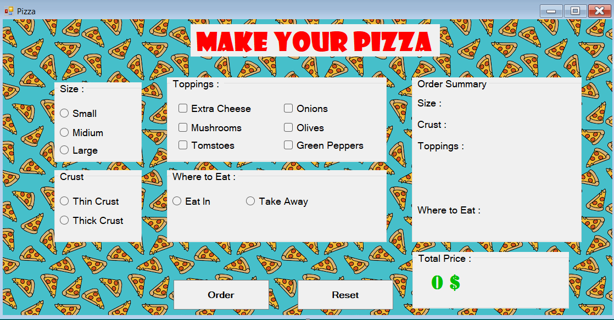

# 🍕 Pizza Order System - Windows Forms Application

A C# Windows Forms application for pizza ordering with order customization, cart management, and order summary.



## Features

- **Pizza Customization**:
  - Select pizza size (Small, Medium, Large)
  - Choose crust type (Thin, Thick, Stuffed)
  - Add multiple toppings (Pepperoni, Mushrooms, Olives, etc.)
  
- **Order Management**:
  - Add/remove items from cart
  - Adjust quantities
  - Clear entire order
  
- **Order Summary**:
  - Detailed receipt generation
  - Total calculation with tax
  - Order confirmation dialog

- **User Experience**:
  - Form validation
  - Responsive UI
  - Error handling

## Technologies Used

- C# (.NET Framework/.NET Core)
- Windows Forms
- [Optional: Any special libraries like MaterialSkin for UI]

## How to Run

1. **Prerequisites**:
   - Visual Studio 2022
   - .NET 6.0/.NET Framework 4.8 [whichever you used]

2. **Installation**:
   ```bash
   git clone https://github.com/yourusername/pizza-order-system.git
